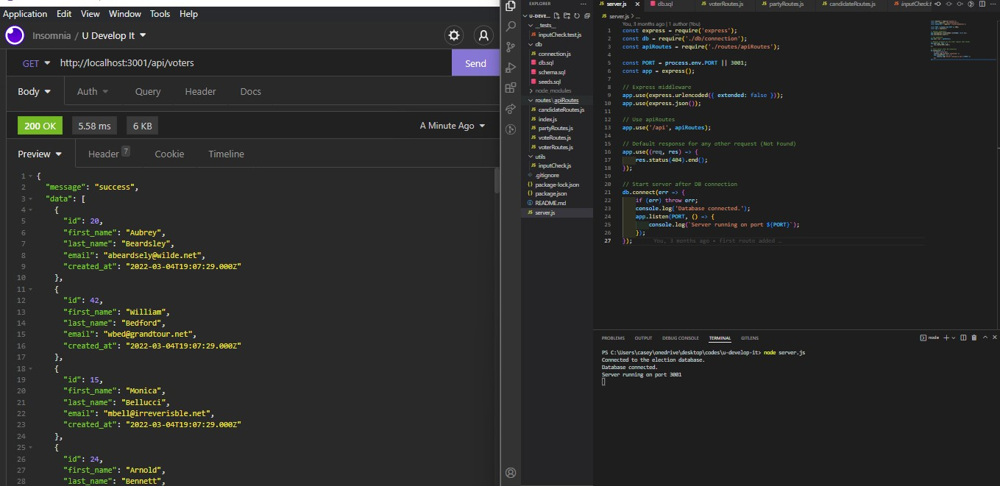

# U Develop It

### Description
This back-end NoSQL web application is a database for candidates, parties, voters, and votes. The MySQL database dynamically creates and joins tables. Data manipulation can be made through Insomnia through the use of API routes.

### License

This application is licensed under MIT

### Application Demo

### Table of Contents
- [Description](#description)
- [Contributing](#contributing)
- [Tests](#tests)
- [Questions?](#questions)

### Contributing
No contributions at this time.

### Tests
inputCheck() returns null when all properties exist, inputCheck() returns an object when a property is missing.

### Questions
GitHub Username: (kcaseychamberlain) 

View the project in GitHub at: https://github.com/KCaseyChamberlain/u-develop-it

If you have any questions, contact Casey at: caseygchamberlain@gmail.com